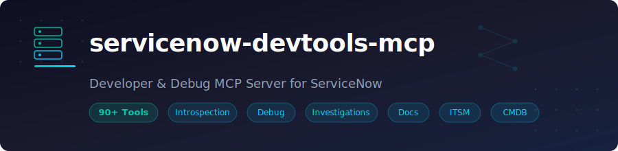

<p align="center">
  
</p>

<p align="center">
  <a href="https://pypi.org/project/servicenow-devtools-mcp/"></a>
  <a href="https://pypi.org/project/servicenow-devtools-mcp/"></a>
  <a href="https://github.com/xerrion/servicenow-devtools-mcp/blob/main/LICENSE"></a>
  
</p>

# servicenow-devtools-mcp

A developer & debug-focused [Model Context Protocol (MCP)](https://modelcontextprotocol.io/) server for ServiceNow. Give your AI agent direct access to your ServiceNow instance for introspection, debugging, change intelligence, and documentation generation.

## Features

- :mag: **Instance Introspection** -- describe tables, query records, compute aggregates, fetch individual records
- :link: **Relationship Mapping** -- find incoming and outgoing references for any record
- :package: **Change Intelligence** -- inspect update sets, diff artifact versions, audit trails, generate release notes
- :bug: **Debug & Trace** -- trace record timelines, flow executions, email chains, integration errors, import set runs
- :test_tube: **Developer Actions** -- toggle artifacts, set properties, seed test data, preview-then-apply updates
- :mag_right: **Investigations** -- 7 built-in analysis modules (stale automations, deprecated APIs, table health, ACL conflicts, error analysis, slow transactions, performance bottlenecks)
- :page_facing_up: **Documentation** -- generate logic maps, artifact summaries, test scenarios, code review notes
- :shield: **Safety** -- table deny lists, sensitive field masking, row limit caps, write gating in production

---

## Quick Start

```bash
# No install needed -- run directly with uvx
uvx servicenow-devtools-mcp
```

Set three required environment variables (or use a `.env` file):

```bash
export SERVICENOW_INSTANCE_URL=https://your-instance.service-now.com
export SERVICENOW_USERNAME=admin
export SERVICENOW_PASSWORD=your-password
```

---

## Configuration

### OpenCode

Add to `~/.config/opencode/opencode.json`:

```json
{
  "mcp": {
    "servicenow": {
      "type": "local",
      "command": ["uvx", "servicenow-devtools-mcp"],
      "environment": {
        "SERVICENOW_INSTANCE_URL": "https://your-instance.service-now.com",
        "SERVICENOW_USERNAME": "admin",
        "SERVICENOW_PASSWORD": "your-password",
        "MCP_TOOL_PACKAGE": "dev_debug",
        "SERVICENOW_ENV": "dev"
      }
    }
  }
}
```

### Claude Desktop

Add to your Claude Desktop config (`claude_desktop_config.json`):

```json
{
  "mcpServers": {
    "servicenow": {
      "command": "uvx",
      "args": ["servicenow-devtools-mcp"],
      "env": {
        "SERVICENOW_INSTANCE_URL": "https://your-instance.service-now.com",
        "SERVICENOW_USERNAME": "admin",
        "SERVICENOW_PASSWORD": "your-password",
        "MCP_TOOL_PACKAGE": "dev_debug",
        "SERVICENOW_ENV": "dev"
      }
    }
  }
}
```

### VS Code / Cursor (Copilot MCP)

Add to `.vscode/mcp.json` in your workspace:

```json
{
  "servers": {
    "servicenow": {
      "command": "uvx",
      "args": ["servicenow-devtools-mcp"],
      "env": {
        "SERVICENOW_INSTANCE_URL": "https://your-instance.service-now.com",
        "SERVICENOW_USERNAME": "admin",
        "SERVICENOW_PASSWORD": "your-password",
        "MCP_TOOL_PACKAGE": "dev_debug",
        "SERVICENOW_ENV": "dev"
      }
    }
  }
}
```

### Generic stdio

```bash
SERVICENOW_INSTANCE_URL=https://your-instance.service-now.com \
SERVICENOW_USERNAME=admin \
SERVICENOW_PASSWORD=your-password \
uvx servicenow-devtools-mcp
```

---

## :robot: Install Instructions for AIs

> Copy the block below and paste it into a conversation with any AI agent that supports MCP tool use. The AI will know how to configure and use this server.

````text
## ServiceNow MCP Server Setup

You have access to a ServiceNow MCP server (`servicenow-devtools-mcp`) that provides
33 tools for interacting with a ServiceNow instance.

### Installation

Run via uvx (no install required):
```
uvx servicenow-devtools-mcp
```

### Required Environment Variables

- SERVICENOW_INSTANCE_URL -- Full URL of the ServiceNow instance (e.g. https://dev12345.service-now.com)
- SERVICENOW_USERNAME -- ServiceNow user with admin or appropriate roles
- SERVICENOW_PASSWORD -- Password for the user above

### Optional Environment Variables

- MCP_TOOL_PACKAGE -- Which tools to load: "dev_debug" (default, all tools), "introspection_only" (read-only), "full" (same as dev_debug), "none"
- SERVICENOW_ENV -- Environment label: "dev" (default), "test", "staging", "prod". Write operations are blocked when set to "prod" unless ALLOW_WRITES_IN_PROD=true.
- MAX_ROW_LIMIT -- Max records per query (default: 100)
- LARGE_TABLE_NAMES_CSV -- Tables requiring date-bounded queries (default: syslog,sys_audit,sys_log_transaction,sys_email_log)

### MCP Client Configuration (stdio transport)

```json
{
  "command": "uvx",
  "args": ["servicenow-devtools-mcp"],
  "env": {
    "SERVICENOW_INSTANCE_URL": "<instance_url>",
    "SERVICENOW_USERNAME": "<username>",
    "SERVICENOW_PASSWORD": "<password>",
    "MCP_TOOL_PACKAGE": "dev_debug",
    "SERVICENOW_ENV": "dev"
  }
}
```

### Available Tools (33 total)

**Introspection (4):** table_describe, table_get, table_query, table_aggregate
  - Describe table schema, fetch records by sys_id, query with encoded queries, compute stats

**Relationships (2):** rel_references_to, rel_references_from
  - Find what references a record and what a record references

**Metadata (4):** meta_list_artifacts, meta_get_artifact, meta_find_references, meta_what_writes
  - List/inspect platform artifacts (business rules, script includes, etc.), find cross-references, find writers to a table

**Change Intelligence (4):** changes_updateset_inspect, changes_diff_artifact, changes_last_touched, changes_release_notes
  - Inspect update sets, diff artifact versions, view audit trail, generate release notes

**Debug & Trace (6):** debug_trace, debug_flow_execution, debug_email_trace, debug_integration_health, debug_importset_run, debug_field_mutation_story
  - Build event timelines, inspect flow executions, trace emails, check integration errors, inspect import sets, trace field mutations

**Developer Actions (6):** dev_toggle, dev_set_property, dev_seed_test_data, dev_cleanup, table_preview_update, table_apply_update
  - Toggle artifacts on/off, set system properties, seed/cleanup test data, preview and apply record updates (two-step confirmation)

**Investigations (2 dispatchers, 7 modules):** investigate_run, investigate_explain
  - Modules: stale_automations, deprecated_apis, table_health, acl_conflicts, error_analysis, slow_transactions, performance_bottlenecks

**Documentation (4):** docs_logic_map, docs_artifact_summary, docs_test_scenarios, docs_review_notes
  - Generate automation maps, artifact summaries with dependencies, test scenario suggestions, code review findings

**Core (1):** list_tool_packages
  - List available tool packages and their contents

### Safety Guardrails

- Table deny list: sys_user_has_role, sys_user_grmember, and other sensitive tables are blocked
- Sensitive fields: password, token, secret fields are masked in responses
- Row limits: Queries capped at MAX_ROW_LIMIT (default 100)
- Large tables: syslog, sys_audit, etc. require date-bounded filters
- Write gating: All write operations blocked when SERVICENOW_ENV=prod (unless explicitly overridden)
- Standardized responses: Tools return JSON with correlation_id, status, data, and optionally pagination and warnings when relevant
````

---

## Environment Variables

| Variable | Description | Default | Required |
|---|---|---|---|
| `SERVICENOW_INSTANCE_URL` | Full URL of your ServiceNow instance | -- | Yes |
| `SERVICENOW_USERNAME` | ServiceNow username (Basic Auth) | -- | Yes |
| `SERVICENOW_PASSWORD` | ServiceNow password | -- | Yes |
| `MCP_TOOL_PACKAGE` | Tool package to load | `dev_debug` | No |
| `SERVICENOW_ENV` | Environment label (`dev`, `test`, `staging`, `prod`) | `dev` | No |
| `MAX_ROW_LIMIT` | Maximum rows returned per query | `100` | No |
| `LARGE_TABLE_NAMES_CSV` | Comma-separated tables requiring date filters | `syslog,sys_audit,sys_log_transaction,sys_email_log` | No |

The server reads from `.env` and `.env.local` files automatically (`.env.local` takes precedence).

---

## Tool Reference

### Core

| Tool | Description | Key Parameters |
|---|---|---|
| `list_tool_packages` | List all available tool packages and their tool groups | -- |

### :mag: Introspection

| Tool | Description | Key Parameters |
|---|---|---|
| `table_describe` | Return field metadata for a table (types, references, choices) | `table` |
| `table_get` | Fetch a single record by sys_id | `table`, `sys_id`, `fields?`, `display_values?` |
| `table_query` | Query a table with encoded query string | `table`, `query`, `fields?`, `limit?`, `offset?`, `order_by?` |
| `table_aggregate` | Compute aggregate stats (count, avg, min, max, sum) | `table`, `query`, `group_by?`, `avg_fields?`, `sum_fields?` |

### :link: Relationships

| Tool | Description | Key Parameters |
|---|---|---|
| `rel_references_to` | Find records in other tables that reference a given record | `table`, `sys_id`, `depth?` |
| `rel_references_from` | Find what a record references via its reference fields | `table`, `sys_id`, `depth?` |

### :package: Metadata

| Tool | Description | Key Parameters |
|---|---|---|
| `meta_list_artifacts` | List platform artifacts by type (business rules, script includes, etc.) | `artifact_type`, `query?`, `limit?` |
| `meta_get_artifact` | Get full artifact details including script body | `artifact_type`, `sys_id` |
| `meta_find_references` | Search all script tables for references to a target string | `target`, `limit?` |
| `meta_what_writes` | Find business rules that write to a table/field | `table`, `field?` |

### :package: Change Intelligence

| Tool | Description | Key Parameters |
|---|---|---|
| `changes_updateset_inspect` | Inspect update set members grouped by type with risk flags | `update_set_id` |
| `changes_diff_artifact` | Show unified diff between two most recent artifact versions | `table`, `sys_id` |
| `changes_last_touched` | Show who last touched a record and what changed (sys_audit) | `table`, `sys_id`, `limit?` |
| `changes_release_notes` | Generate Markdown release notes from an update set | `update_set_id`, `format?` |

### :bug: Debug & Trace

| Tool | Description | Key Parameters |
|---|---|---|
| `debug_trace` | Build merged timeline from sys_audit, syslog, and journal | `record_sys_id`, `table`, `minutes?` |
| `debug_flow_execution` | Inspect a Flow Designer execution step by step | `context_id` |
| `debug_email_trace` | Reconstruct email chain for a record | `record_sys_id` |
| `debug_integration_health` | Summarize recent integration errors (ECC queue or REST) | `kind?`, `hours?` |
| `debug_importset_run` | Inspect import set run with row-level results | `import_set_sys_id` |
| `debug_field_mutation_story` | Chronological mutation history of a single field | `table`, `sys_id`, `field`, `limit?` |

### :test_tube: Developer Actions

| Tool | Description | Key Parameters |
|---|---|---|
| `dev_toggle` | Toggle active/inactive on a platform artifact | `artifact_type`, `sys_id`, `active` |
| `dev_set_property` | Set a system property value (returns old value) | `name`, `value` |
| `dev_seed_test_data` | Create test data records with cleanup tracking | `table`, `records` (JSON string), `tag?` |
| `dev_cleanup` | Delete all records previously seeded with a tag | `tag` |
| `table_preview_update` | Preview a record update with field-level diff | `table`, `sys_id`, `changes` (JSON string) |
| `table_apply_update` | Apply a previously previewed update | `preview_token` |

### :mag_right: Investigations

| Tool | Description | Key Parameters |
|---|---|---|
| `investigate_run` | Run a named investigation module | `investigation`, `params?` (JSON string) |
| `investigate_explain` | Get detailed explanation for a specific finding | `investigation`, `element_id` |

**Available investigation modules:**

| Module | What it does |
|---|---|
| `stale_automations` | Find disabled or unused business rules, flows, and scheduled jobs |
| `deprecated_apis` | Scan scripts for deprecated ServiceNow API usage |
| `table_health` | Analyze table size, index coverage, and schema issues |
| `acl_conflicts` | Detect conflicting or redundant ACL rules |
| `error_analysis` | Aggregate and categorize recent errors from syslog |
| `slow_transactions` | Find slow-running transactions from sys_log_transaction |
| `performance_bottlenecks` | Identify performance issues across flows, queries, and scripts |

### :page_facing_up: Documentation

| Tool | Description | Key Parameters |
|---|---|---|
| `docs_logic_map` | Generate lifecycle logic map of all automations on a table | `table` |
| `docs_artifact_summary` | Generate artifact summary with dependency analysis | `artifact_type`, `sys_id` |
| `docs_test_scenarios` | Analyze script and suggest test scenarios | `artifact_type`, `sys_id` |
| `docs_review_notes` | Scan script for anti-patterns and generate review notes | `artifact_type`, `sys_id` |

---

## Tool Packages

Control which tools are loaded using the `MCP_TOOL_PACKAGE` environment variable:

| Package | Tools Loaded | Use Case |
|---|---|---|
| `dev_debug` (default) | All 33 tools | Full development and debugging |
| `full` | All 33 tools | Same as dev_debug |
| `introspection_only` | Introspection + Relationships + Metadata (10 tools) | Read-only exploration |
| `none` | Only `list_tool_packages` | Minimal / testing |

---

## Safety & Policy

The server includes built-in guardrails that are always active:

- **Table deny list** -- Sensitive tables like `sys_user_has_role` and `sys_user_grmember` are blocked from queries
- **Sensitive field masking** -- Fields whose names contain patterns like `password`, `token`, `secret`, `credential`, `api_key`, or `private_key` are masked with the literal value `***MASKED***` in responses
- **Row limit caps** -- All queries are capped at `MAX_ROW_LIMIT` (default 100). If a tool requests more, the limit is silently reduced and a warning is included
- **Large table protection** -- Tables listed in `LARGE_TABLE_NAMES_CSV` require date-bounded filters in queries to prevent full-table scans
- **Write gating** -- All write operations (`dev_toggle`, `dev_set_property`, `dev_seed_test_data`, `table_preview_update`, etc.) are blocked when `SERVICENOW_ENV=prod`
- **Standardized responses** -- Every tool returns a JSON envelope with `correlation_id`, `status`, `data`, `pagination`, and `warnings` for consistent error handling

---

## Example Prompts

Here are some real-world prompts you can use with an AI agent that has this MCP server connected:

> Describe the incident table and show me all the business rules that fire on it.

> Query the last 10 P1 incidents that were resolved this week and show who resolved them.

> Trace the full lifecycle of incident INC0010042 -- show me every field change, comment, and log entry.

> Inspect update set "Q1 Release" and generate release notes. Flag any risky changes.

> Run the stale_automations investigation and explain the top findings.

> Find all scripts that reference the "cmdb_ci_server" table and check them for anti-patterns.

> Seed 3 test incidents with different priorities, verify they were created, then clean them up.

> Show me the performance bottlenecks investigation and explain any slow transactions found.

---

## Development

```bash
# Clone the repository
git clone https://github.com/xerrion/servicenow-devtools-mcp.git
cd servicenow-devtools-mcp

# Install dependencies
uv sync

# Run unit tests (207 tests)
uv run pytest

# Run integration tests (requires .env.local with real credentials)
uv run pytest -m integration

# Run the server locally
uv run servicenow-devtools-mcp
```

---

## License

[MIT](LICENSE)
